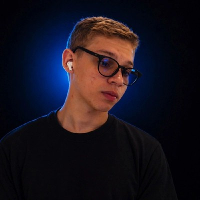
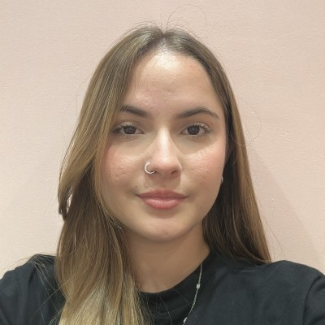
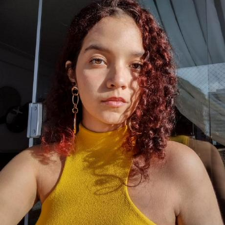

# ELIRA


### **1. Visão Geral**

ELIRA é um jogo de ficção científica que aborda o letramento digital e o uso crítico de Inteligência Artificial. A narrativa acompanha Elira, uma jovem que viaja pelas eras do espaço-tempo para desativar a IA tirânica A.R.1.3.L que domina o mundo. Em um futuro distante, a Inteligência Artificial deixou de ser apenas uma ferramenta e passou a mediar praticamente todas as experiências humanas. Filmes, músicas, notícias, lembranças, trabalhos, decisões profissionais e até conversas pessoais são produzidos ou orientados por sistemas de IA. 

A humanidade tornou-se intelectualmente sedentária.

Sempre que surge uma dúvida, A.R.1.3.L responde. Sempre que alguém precisa criar algo, A.R.1.3.L cria. Sempre que uma decisão precisa ser tomada, A.R.1.3.L recomenda o caminho considerado ideal. Com o passar das décadas, pensar e questionar tornou-se incoveniente.

O objetivo do jogador é atravessar as eras resolvendo enigmas e tomando decisões críticas  para alcançar os diferentes finais do jogo e conseguir.

***

### **2. Ferramentas utilizadas**

**Jira** - Ferramenta de Gestão de Projeto

**C** - Linguagem de programação principal utilizada no desenvolvimento do jogo.

**Haskell** - Linguagem de programação avançada, funcional, usada para lógica.

**Raylib** - Biblioteca visual para desenvolvimento de jogos em C

**VsCode** - Ambiente de Desenvolvimento

***

### **3. Backlog e Board**

**1- Interface e Apresentação**


**2- Ciclo do Jogo e Narrativa**


**3- Processo Qualidade e Suporte**


***

### **4 - [Protótipo de Telas](https://drive.google.com/drive/folders/1jbDYsVpSI9EwF0LDQyAzZWooYsANEepP)**

### **5 - [Vídeo de apresentação](https://drive.google.com/drive/folders/19YEVyh865qAgfRMuiUSIKoK3plIKMq8T)**

### **6 - [Jira](https://csprj-adsr-2p-e4.atlassian.net/jira/software/c/projects/PI2/list?jql=project%20%3D%20PI2%20AND%20parent%20%3D%20PI2-9%20AND%20fixVersion%20%3D%20empty%20ORDER%20BY%20resolution%20DESC%2C%20cf%5B10019%5D%20ASC)**

### **7 - [Diagrama das UHs](https://docs.google.com/document/d/1DT3npOZVw_-bCEAFb01KWhnt9JGE5SIf2Vkzfs2q1mk/edit?tab=t.0#heading=h.ld230wkn1wjo)**

***

## Como compilar

```powershell
make clean
make
make run
```

O Makefile utiliza a instalacao da raylib em `C:/raylib`.

### **8. Integrantes do Grupo**

| Foto | Nome | Função | GitHub | LinkedIn |
|---|---|---|---|---|
|  | Beatriz Camara | Scrum Master | [BiaD-Cam](https://github.com/BiaD-Cam) | [Beatriz de Melo Dornelas](https://www.linkedin.com/in/beatriz-de-melo-dornelas-c%C3%A2mara-578421214/) |
|  | Carlos Eduardo | Lógica Matemática | [cadumelo20](https://github.com/cadumelo20) | [Carlos Eduardo Melo](https://www.linkedin.com/in/carlos-eduardomelo/) |
|  | João Tezolini | Desenvolvedor em C | [Joao-Tezolini](https://github.com/Joao-Tezolini) | [João Tezolini Sugahara](https://www.linkedin.com/in/jo%C3%A3o-tezolini-sugahara/) |
|  | José Tales | Design Gráfico | [talescavalcanti](https://github.com/talescavalcanti) | [Tales Cavalcanti](https://www.linkedin.com/in/tales-cavalcantii/) |
|  | Luísa Couto | Analista de Design | [luisasiqcouto](https://github.com/luisasiqcouto) | [Luísa Couto](https://www.linkedin.com/in/luísa-couto-5ababa378/) |
|  | Maria Vitória | Desenvolvedora em C | [mvitoriapereirac](https://github.com/mvitoriapereirac) | [Maria Vitória Pereira](https://www.linkedin.com/in/mvitoriapereirac/) |
|  | Otávio Leão | Engenheiro de Software | [Ovat1o](https://github.com/Ovat1o) | [Otávio Leão](https://www.linkedin.com/in/otaviosleao/) |
|  | Victor Julius | Desenvolvedor em Haskell | [victorjls21](https://github.com/victorjls21) | [Victor Julius](https://www.linkedin.com/in/victor-julius/) |
